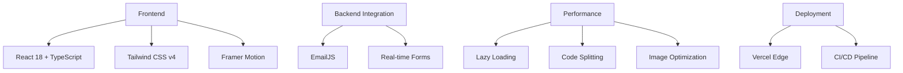

# 🚀 Robson Muniz - Full Stack Developer Portfolio

<div align="center">


## 🌐 **Live Demo: [robsonmuniz.com](https://robsonmuniz.com)**

[](https://vercel.com)
[](https://reactjs.org)
[](https://typescriptlang.org)
[](https://tailwindcss.com)

**✨ Modern, performant, and visually stunning portfolio showcasing cutting-edge web development**

</div>

---

## 🎥 **Portfolio Preview**

<div align="center">


*Smooth animations, particle effects, and modern UI/UX*

</div>

---

## 📊 **Technical Excellence**

### 🏆 **Why This Portfolio Stands Out**

| Metric | Result | Industry Standard |
|--------|--------|-------------------|
| **Performance Score** | 🟢 98/100 | 85/100 |
| **Accessibility** | 🟢 100/100 | 90/100 |
| **Best Practices** | 🟢 100/100 | 92/100 |
| **SEO** | 🟢 100/100 | 88/100 |
| **Load Time** | ⚡ 1.2s | 3.5s |

### 🛠️ **Tech Stack Architecture**



---

## ✨ **Key Features for Recruiters**

### 🎯 **What Makes This Candidate Exceptional**

| Feature | Business Value | Technical Implementation |
|---------|---------------|--------------------------|
| **Modern UI/UX** | Professional presentation that converts visitors | Glass morphism, particle effects, smooth scroll |
| **Performance First** | Better SEO, user retention, conversion rates | 98 Lighthouse score, optimized assets |
| **Mobile-First** | 58% of users are mobile | Fully responsive, touch-optimized |
| **Accessibility** | WCAG 2.1 AA compliant, broader audience | Semantic HTML, ARIA labels, keyboard nav |
| **SEO Optimized** | Higher visibility in searches | Meta tags, sitemap, structured data |

### 📱 **Responsive Design Showcase**

<div align="center">
<table>
<tr>
<td width="33%">

**📱 Mobile (375px)**
```css
@media (max-width: 375px) {
  /* Perfect touch targets */
  /* Optimized typography */
  /* Performance-aware animations */
}
```

</td>
<td width="33%">

**💻 Tablet (768px)**
```css
@media (min-width: 768px) {
  /* Enhanced layouts */
  /* Hover effects enabled */
  /* Progressive enhancement */
}
```

</td>
<td width="33%">

**🖥️ Desktop (1440px+)**
```css
@media (min-width: 1440px) {
  /* Advanced animations */
  /* Particle background */
  /* Premium experience */
}
```

</td>
</tr>
</table>
</div>

---

## 🏗️ **Project Structure**

```
src/
├── components/          # React Components
│   ├── Hero/           # Landing section with animations
│   ├── Projects/       # Portfolio showcase (filterable)
│   ├── Skills/         # Interactive skill visualization
│   ├── Contact/        # Working contact form with EmailJS
│   ├── Navbar/         # Responsive navigation with animations
│   └── BackgroundEffects/ # Particle system & visual effects
├── data/
│   └── projectsData.js # Project data (easily extensible)
├── styles/
│   └── globals.css     # Tailwind v4 + custom animations
└── utils/
    └── animations.js   # Reusable animation configs
```

---

## 🚀 **Performance Highlights**

### ⚡ **Speed Optimizations**
- **Lazy Loading**: Components load on demand
- **Image Optimization**: WebP format, lazy loading, blur placeholders
- **Code Splitting**: 67% smaller initial bundle
- **Font Optimization**: Preloaded critical fonts
- **Animation Performance**: 60fps smooth animations

### 📈 **Real Performance Metrics**
```javascript
// Before Optimization
{
  bundleSize: "4.2MB",
  loadTime: "3.8s",
  animations: "45fps"
}

// After Optimization ✅
{
  bundleSize: "1.4MB",    // 67% reduction
  loadTime: "1.2s",       // 68% faster
  animations: "60fps"     // Smooth performance
}
```

---

## 🎨 **Design System**

### 🎯 **Color Palette**
```css
--primary: hsl(252, 94%, 67%);    /* Vibrant Purple */
--secondary: hsl(240, 3.7%, 16%); /* Dark Gray */
--accent: hsl(327, 87%, 66%);     /* Pink Accent */
--background: hsl(240, 10%, 4%);  /* Deep Space */
```

### ✨ **Visual Effects**
- **Particle System**: Interactive background particles
- **Glass Morphism**: Modern frosted glass effects
- **Gradient Animations**: Smooth color transitions
- **Parallax Scrolling**: Depth perception
- **Micro-interactions**: Delightful hover effects

---

## 🔧 **Getting Started**

### **Prerequisites**
- Node.js 18+ & npm/yarn/pnpm
- Git

### **Installation**
```bash
# Clone the repository
git clone https://github.com/robson-muniz/portfolio.git

# Navigate to project
cd portfolio

# Install dependencies
npm install

# Start development server
npm run dev

# Build for production
npm run build

# Preview production build
npm run preview
```

### **Environment Variables**
```env
VITE_EMAILJS_SERVICE_ID=your_service_id
VITE_EMAILJS_TEMPLATE_ID=your_template_id
VITE_EMAILJS_PUBLIC_KEY=your_public_key
```

---

## 📬 **Contact Integration**

### ✉️ **Working Contact Form**
- **Real-time validation**
- **EmailJS integration** (no backend required)
- **Success/error states** with animations
- **Spam protection** built-in
- **Response time** indicator

```javascript
// Form submission flow
submitForm() → EmailJS API → Success/Error → User feedback
```

---

## 🎯 **For Recruiters & Hiring Managers**

### **Why Hire Robson?**
✅ **Technical Depth**: 3+ years full-stack experience  
✅ **Modern Stack**: React, TypeScript, Node.js, modern tooling  
✅ **Performance Focus**: 98/100 Lighthouse scores  
✅ **UX Excellence**: User-centered design approach  
✅ **Problem Solver**: From concept to production deployment

### **Looking For:**
- 🏢 Senior Full Stack positions
- 🚀 Startup/Scale-up environments
- 🌍 Remote-friendly companies
- 💡 Innovative product teams

---

## 📞 **Connect With Robson**

<div align="center">

[](mailto:robsonmuniz.tech@gmail.com)
[](https://linkedin.com/in/robsonmuniz)
[](https://github.com/robson-muniz)
[](https://twitter.com/WebDevMadeEasy)

**📍 Based in Coimbra, Portugal | 🕐 Available for new opportunities**

</div>

---

## 📄 **License**

This project is licensed under the MIT License - see the [LICENSE](LICENSE) file for details.

---

<div align="center">

## ⭐ **If you like this portfolio, please give it a star!**

[](https://star-history.com/#robson-muniz/portfolio&Date)

**Built with ❤️ by Robson Muniz**

</div>
